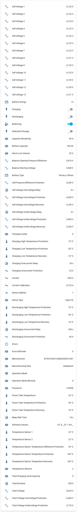
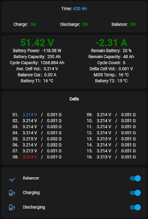

# esphome-jk-bms


[](https://www.buymeacoffee.com/syssi)

ESPHome component to monitor a Jikong Battery Management System (JK-BMS) via UART-TTL or BLE



## Supported devices

All JK-BMS models with software version `>=6.0` are using the implemented protocol and should be supported.

* JK-BD4A8S4P, hw 11.xw, sw 11.24, using `JK02_32S` (reported by [@austin202220](https://github.com/syssi/esphome-jk-bms/issues/297))
* JK-BD6A17S6P, hw 7.2, sw 7.1.0H
* JK-BD6A17S8P, hw 9.x, sw 9.01G (reported by [@jonadis](https://github.com/syssi/esphome-jk-bms/issues/35#issuecomment-1035312712))
* JK-BD6A20S10P, hw 10.XW, sw 10.07 (reported by [@adadrag](https://github.com/syssi/esphome-jk-bms/issues/123))
* JK-BD6A20S12P, hw 11.XW, sw 11.281, using UART-TTL (reported by [@asiridissa](https://github.com/syssi/esphome-jk-bms/discussions/339))
* JK-BD6A20S6P, hw 11.XW, sw 11.42, using UART-TTL (reported by [@parumsancto](https://github.com/syssi/esphome-jk-bms/issues/537))
* JK-BD6A24S6P, hw 6.x, sw 6.10S (reported by [@ziporah](https://github.com/syssi/esphome-jk-bms/issues/41))
* JK-BD6A24S10P, hw 8.x, sw 8.0.6G (reported by [@spoonwzd](https://github.com/syssi/esphome-jk-bms/issues/67#issuecomment-1093844076))
* JK-BD6A24S10P, hw 10.xw, sw 10.09 (reported by [@PMPoulsen](https://github.com/syssi/esphome-jk-bms/discussions/261#discussioncomment-5091812))
* JK-BD6A24S12P, hw v11.XW, sw 11.36, using `JK02_32S` (BLE) (reported by [@hackmannbr](https://github.com/syssi/esphome-jk-bms/issues/674))
* JK-BD4A17S4P, hw 11.xw, sw 11.01 (reported by [@Condor-XYZ](https://github.com/syssi/esphome-jk-bms/issues/221))
* JK-BD4A17S4P, hw 11.xw, sw 11.27, using `JK02_32S` and/or UART-TTL (reported by [@hemskgren](https://github.com/syssi/esphome-jk-bms/issues/359))
* JK-B1A8S10P, hw 11.XW, sw 11.261, using `JK02_32S` (reported by [@Chickenbreast0](https://github.com/syssi/esphome-jk-bms/issues/346))
* JK-B1A24S15P, hw 8.x, sw 8.1.0H (reported by [@killee](https://github.com/syssi/esphome-jk-bms/discussions/4))
* JK-B1A20S15P, hw 8.x, sw 8.14U (reported by  [@trippfam07](https://github.com/syssi/esphome-jk-bms/issues/31))
* JK-B1A20S15P, hw 10.xw, sw 10.07 (reported by [@romeox44](https://github.com/syssi/esphome-jk-bms/discussions/125))
* JK-B1A20S15P, hw 10.xw, sw 10.10, using `JK02_24S` (reported by [@austin202220](https://github.com/syssi/esphome-jk-bms/issues/297#issuecomment-1510685683))
* JK-B1A20S15P, hw 11.xw, sw 11.26, using UART-TTL (reported by [@Tesla72PL](https://github.com/syssi/esphome-jk-bms/issues/309))
* JK-B2A24S15P, hw 6.x, sw 6.1.3S (reported by [@miguel300477](https://github.com/syssi/esphome-jk-bms/issues/57))
* JK-B2A24S15P, hw 8.x, sw 8.21W (reported by [@mariusvaida](https://github.com/syssi/esphome-jk-bms/issues/120))
* JK-B2A24S15P, hw 10.xw, sw 10.07, using `JK02_24S` (BLE) and UART-TTL
* JK-B2A24S15P, hw 10.xw, sw 10.08 (reported by [@meccip](https://github.com/syssi/esphome-jk-bms/discussions/175#discussioncomment-3687287))
* JK-B2A24S15P, hw 10.xw, sw 10.10, using UART-TTL (reported by [@nayias](https://github.com/syssi/esphome-jk-bms/discussions/257#discussioncomment-5062807))
* JK-B2A24S20P, hw 8.x, sw 8.1.2H, using `JK02_24S` (reported by [@KlausLi](https://github.com/syssi/esphome-jk-bms/issues/15#issuecomment-961447064))
* JK-B2A24S20P, hw 8.x, sw 8.20G, using `JK02_24S` (reported by [@rob-oravec](https://github.com/syssi/esphome-jk-bms/discussions/46))
* JK-B2A24S20P, hw 10.X-W, sw 10.02, using `JK02_24S` (reported by [@SeByDocKy](https://github.com/syssi/esphome-jk-bms/issues/37#issuecomment-1040569576))
* JK-B2A24S20P, hw 10.XG, sw 10.07D30, using `JK02_24S` (reported by [@TheSmartGerman](https://github.com/syssi/esphome-jk-bms/discussions/122))
* JK-B2A24S20P, hw 10.XW, sw 10.07, using `JK02_24S` (reported by [@amagr0](https://github.com/syssi/esphome-jk-bms/issues/124#issuecomment-1166366196))
* JK-B2A24S20P, hw 10.XW, sw 10.09, using `JK02_24S` (reported by [@Ghilm1986](https://github.com/syssi/esphome-jk-bms/issues/591))
* JK-B2A8S20P,  hw 9.x, sw 9.01M3, using `JK02_24S` (reported by [@EasilyBoredEngineer](https://github.com/syssi/esphome-jk-bms/discussions/110))
* JK-B2A8S20P, hw 9.x, sw 9.08W (reported by [@vrabi-cv](https://github.com/syssi/esphome-jk-bms/discussions/144#discussioncomment-3285901))
* JK-B2A8S20P, hw 11.XW, sw 11.17, using `JK02_32S` (reported by [@senfkorn](https://github.com/syssi/esphome-jk-bms/issues/147))
* JK-B2A8S20P, hw 11.XW, sw 11.26, using `JK02_32S` (reported by [@riker65](https://github.com/syssi/esphome-jk-bms/issues/276))
* JK-B2A8S20P, hw 11.XA, sw 11.48, using UART-TTL (reported by [@BytEvil](https://github.com/syssi/esphome-jk-bms/issues/588))
* JK-B2A20S20P, hw 10.XW, sw 10.09 (reported by [@markusgg84](https://github.com/syssi/esphome-jk-bms/discussions/173))
* JK-B2A20S20P, hw 10.XW, sw 10.10, using `JK02_24S` (reported by [@cygeus](https://github.com/syssi/esphome-jk-bms/issues/455))
* JK-B2A20S20P, hw 10.XW, sw 11.21h, using `JK02_32S` (reported by [@Salve87](https://github.com/syssi/esphome-jk-bms/issues/308#issuecomment-1505614325))
* JK-B2A20S20P, hw 11.XW, sw 11.24H, using `JK02_32S` (reported by [@austin202220](https://github.com/syssi/esphome-jk-bms/discussions/232))
* JK-B2A20S20P, hw 11.XW, sw 11.25H, using `JK02_32S` (reported by [@iovcharyk](https://github.com/syssi/esphome-jk-bms/issues/249))
* JK-B2A20S20P, hw 11.XW, sw 11.284, using `JK02_32S` (BLE) and UART-TTL (reported by [@martinSezman](https://github.com/syssi/esphome-jk-bms/issues/458))
* JK-B5A24S, hw 8.x, sw 8.0.3M, using `JK04` (reported by [@JSladen](https://github.com/syssi/esphome-jk-bms/issues/213))
* JK-B2A16S, hw 3.0, sw 3.3.0, using `JK04` (reported by [@magnetus26](https://github.com/syssi/esphome-jk-bms/discussions/48))
* GW-24S4EB (NEEY/Heltec 4A Smart Active Balancer), hw HW-2.8.0, sw ZH-1.2.3 (reported by [@cristi2005](https://github.com/syssi/esphome-jk-bms/issues/109))
* GW-24S4EB (NEEY 4A Smart Active Balancer 4th generation), hw HW-3.2.0, sw ZH-1.2.4 (reported by [@fabhund](https://github.com/syssi/esphome-jk-bms/issues/310))

## Requirements

* [ESPHome 2024.6.0 or higher](https://github.com/esphome/esphome/releases).
* Generic ESP32 or ESP8266 board

## Schematics

<a href="https://raw.githubusercontent.com/syssi/esphome-jk-bms/main/images/circuit.jpg" target="_blank">

</a>


```
                UART-TTL
┌──────────┐                ┌─────────┐
│          │<----- RX ----->│         │
│  JK-BMS  │<----- TX ----->│ ESP32/  │
│          │<----- GND ---->│ ESP8266 │<-- 3.3V
│          │                │         │<-- GND
└──────────┘                └─────────┘

# UART-TTL socket (4 Pin, JST 1.25mm pitch)
┌─── ─────── ────┐
│                │
│ O   O   O   O  │
│GND  RX  TX VBAT│
└────────────────┘
  │   │   │
  │   │   └─── GPIO17 (`rx_pin`)
  │   └─────── GPIO16 (`tx_pin`)
  └─────────── GND
```


The UART-TTL (labeled as `RS485`) socket of the BMS can be attached to any UART pins of the ESP. A hardware UART should be preferred because of the high baudrate (115200 baud). The connector is called 4 Pin JST with 1.25mm pitch.

## Installation

You can install this component with [ESPHome external components feature](https://esphome.io/components/external_components.html) like this:
```yaml
external_components:
  - source: github://syssi/esphome-jk-bms@main
```

or just use the `esp32-example.yaml` as proof of concept:

```bash
# Install esphome
pip3 install esphome

# Clone this external component
git clone https://github.com/syssi/esphome-jk-bms.git
cd esphome-jk-bms

# Create a secrets.yaml containing some setup specific secrets
cat > secrets.yaml <<EOF
wifi_ssid: MY_WIFI_SSID
wifi_password: MY_WIFI_PASSWORD

mqtt_host: MY_MQTT_HOST
mqtt_username: MY_MQTT_USERNAME
mqtt_password: MY_MQTT_PASSWORD
EOF

# Validate the configuration, create a binary, upload it, and start logs
# If you use a esp8266 run the esp8266-example.yaml
esphome run esp32-example.yaml

```

## Example response all sensors enabled

```
[sensor:127]: 'jk-bms cell voltage 1': Sending state 4.12500 V with 3 decimals of accuracy
[sensor:127]: 'jk-bms cell voltage 2': Sending state 4.12500 V with 3 decimals of accuracy
[sensor:127]: 'jk-bms cell voltage 3': Sending state 4.12800 V with 3 decimals of accuracy
[sensor:127]: 'jk-bms cell voltage 4': Sending state 4.12400 V with 3 decimals of accuracy
[sensor:127]: 'jk-bms cell voltage 5': Sending state 4.12500 V with 3 decimals of accuracy
[sensor:127]: 'jk-bms cell voltage 6': Sending state 4.12800 V with 3 decimals of accuracy
[sensor:127]: 'jk-bms cell voltage 7': Sending state 4.12400 V with 3 decimals of accuracy
[sensor:127]: 'jk-bms cell voltage 8': Sending state 4.12300 V with 3 decimals of accuracy
[sensor:127]: 'jk-bms cell voltage 9': Sending state 4.12800 V with 3 decimals of accuracy
[sensor:127]: 'jk-bms cell voltage 10': Sending state 4.12800 V with 3 decimals of accuracy
[sensor:127]: 'jk-bms cell voltage 11': Sending state 4.12800 V with 3 decimals of accuracy
[sensor:127]: 'jk-bms cell voltage 12': Sending state 4.13100 V with 3 decimals of accuracy
[sensor:127]: 'jk-bms cell voltage 13': Sending state 4.12400 V with 3 decimals of accuracy
[sensor:127]: 'jk-bms power tube temperature': Sending state 24.00000 °C with 0 decimals of accuracy
[sensor:127]: 'jk-bms temperature sensor 1': Sending state 22.00000 °C with 0 decimals of accuracy
[sensor:127]: 'jk-bms temperature sensor 2': Sending state 22.00000 °C with 0 decimals of accuracy
[sensor:127]: 'jk-bms total voltage': Sending state 53.64000 V with 2 decimals of accuracy
[sensor:127]: 'jk-bms current': Sending state -0.00000 A with 2 decimals of accuracy
[sensor:127]: 'jk-bms capacity remaining': Sending state 99.00000 % with 0 decimals of accuracy
[sensor:127]: 'jk-bms temperature sensors': Sending state 2.00000  with 0 decimals of accuracy
[sensor:127]: 'jk-bms charging cycles': Sending state 0.00000  with 0 decimals of accuracy
[sensor:127]: 'jk-bms total charging cycle capacity': Sending state 0.00000  with 0 decimals of accuracy
[sensor:127]: 'jk-bms battery strings': Sending state 13.00000  with 0 decimals of accuracy
[sensor:127]: 'jk-bms errors bitmask': Sending state 0.00000  with 0 decimals of accuracy
[text_sensor:015]: 'jk-bms errors': Sending state ''
[sensor:127]: 'jk-bms operation mode bitmask': Sending state 0.00000  with 0 decimals of accuracy
[text_sensor:015]: 'jk-bms operation mode': Sending state ''
[sensor:127]: 'jk-bms total voltage overvoltage protection': Sending state 5.46000 V with 3 decimals of accuracy
[sensor:127]: 'jk-bms total voltage undervoltage protection': Sending state 3.77000 V with 3 decimals of accuracy
[sensor:127]: 'jk-bms cell voltage overvoltage protection': Sending state 4.20000 V with 3 decimals of accuracy
[sensor:127]: 'jk-bms cell voltage overvoltage recovery': Sending state 4.10000 V with 3 decimals of accuracy
[sensor:127]: 'jk-bms cell voltage overvoltage delay': Sending state 5.00000 s with 0 decimals of accuracy
[sensor:127]: 'jk-bms cell voltage undervoltage protection': Sending state 2.90000 V with 3 decimals of accuracy
[sensor:127]: 'jk-bms cell voltage undervoltage recovery': Sending state 3.20000 V with 3 decimals of accuracy
[sensor:127]: 'jk-bms cell voltage undervoltage delay': Sending state 5.00000 s with 0 decimals of accuracy
[sensor:127]: 'jk-bms cell pressure difference protection': Sending state 0.30000 V with 3 decimals of accuracy
[sensor:127]: 'jk-bms discharging overcurrent protection': Sending state 60.00000 A with 0 decimals of accuracy
[sensor:127]: 'jk-bms discharging overcurrent delay': Sending state 300.00000 s with 0 decimals of accuracy
[sensor:127]: 'jk-bms charging overcurrent protection': Sending state 25.00000 A with 0 decimals of accuracy
[sensor:127]: 'jk-bms charging overcurrent delay': Sending state 30.00000 s with 0 decimals of accuracy
[sensor:127]: 'jk-bms balance starting voltage': Sending state 3.30000 V with 3 decimals of accuracy
[sensor:127]: 'jk-bms balance opening pressure difference': Sending state 0.01000 V with 3 decimals of accuracy
[switch:045]: 'jk-bms balancing': Sending state ON
[sensor:127]: 'jk-bms power tube temperature protection': Sending state 90.00000 °C with 0 decimals of accuracy
[sensor:127]: 'jk-bms power tube temperature recovery': Sending state 70.00000 °C with 0 decimals of accuracy
[sensor:127]: 'jk-bms temperature sensor temperature protection': Sending state 100.00000 °C with 0 decimals of accuracy
[sensor:127]: 'jk-bms temperature sensor temperature recovery': Sending state 100.00000 °C with 0 decimals of accuracy
[sensor:127]: 'jk-bms temperature sensor temperature difference protection': Sending state 20.00000 °C with 0 decimals of accuracy
[sensor:127]: 'jk-bms charging high temperature protection': Sending state 70.00000 °C with 0 decimals of accuracy
[sensor:127]: 'jk-bms discharging high temperature protection': Sending state 70.00000 °C with 0 decimals of accuracy
[sensor:127]: 'jk-bms charging low temperature protection': Sending state -20.00000 °C with 0 decimals of accuracy
[sensor:127]: 'jk-bms charging low temperature recovery': Sending state -10.00000 °C with 0 decimals of accuracy
[sensor:127]: 'jk-bms discharging low temperature protection': Sending state -20.00000 °C with 0 decimals of accuracy
[sensor:127]: 'jk-bms discharging low temperature recovery': Sending state -10.00000 °C with 0 decimals of accuracy
[switch:045]: 'jk-bms charging': Sending state OFF
[switch:045]: 'jk-bms discharging': Sending state OFF
[sensor:127]: 'jk-bms current calibration': Sending state 0.72500 A with 3 decimals of accuracy
[sensor:127]: 'jk-bms device address': Sending state 1.00000  with 0 decimals of accuracy
[text_sensor:015]: 'jk-bms battery type': Sending state 'Ternary Lithium'
[sensor:127]: 'jk-bms sleep wait time': Sending state 10.00000 s with 0 decimals of accuracy
[sensor:127]: 'jk-bms alarm low volume': Sending state 20.00000  with 0 decimals of accuracy
[text_sensor:015]: 'jk-bms password': Sending state '123456'
[switch:045]: 'jk-bms dedicated charger': Sending state OFF
[text_sensor:015]: 'jk-bms device type': Sending state 'Input Us'
[sensor:127]: 'jk-bms total runtime': Sending state 0.00000 h with 0 decimals of accuracy
[text_sensor:015]: 'jk-bms software version': Sending state 'H7.X__S7.1.0H__'
[sensor:127]: 'jk-bms actual_battery_capacity': Sending state 186.00000 Ah with 0 decimals of accuracy
[text_sensor:015]: 'jk-bms manufacturer': Sending state 'BT3072020120000200521001'
[sensor:127]: 'jk-bms protocol version': Sending state 1.00000  with 0 decimals of accuracy
```

## Known issues

* The battery type sensor is pretty useless because the BMS reports always the same value (`Ternary Lithium`). Regardless of which battery type was set / parameter set was loaded via the android app. ([#9][i9])
* ESP32: Adding all supported sensors can lead to a stack overflow / boot loop. This can be solved by increasing the stack size. ([#63][i63])

[i9]: https://github.com/syssi/esphome-jk-bms/issues/9
[i63]: https://github.com/syssi/esphome-jk-bms/issues/63

## Goodies

A user of this project ([@dr3amr](https://github.com/dr3amr)) shared some [Home Assistant Lovelace UI cards for a beautiful dashboard here](https://github.com/syssi/esphome-jk-bms/discussions/230).



## Debugging

If this component doesn't work out of the box for your device please update your configuration to enable the debug output of the UART component and increase the log level to the see outgoing and incoming serial traffic:

```
logger:
  level: DEBUG

uart:
  - id: uart_0
    baud_rate: 115200
    rx_buffer_size: 384
    tx_pin: ${tx_pin}
    rx_pin: ${rx_pin}
    debug:
      direction: BOTH
```

## References

* https://secondlifestorage.com/index.php?threads/jk-b1a24s-jk-b2a24s-active-balancer.9591/
* https://github.com/jblance/jkbms
* https://github.com/jblance/mpp-solar/issues/112
* https://github.com/jblance/mpp-solar/blob/master/mppsolar/protocols/jk232.py
* https://github.com/jblance/mpp-solar/blob/master/mppsolar/protocols/jk485.py
* https://github.com/sshoecraft/jktool
* https://github.com/Louisvdw/dbus-serialbattery/blob/master/etc/dbus-serialbattery/jkbms.py
* https://blog.ja-ke.tech/2020/02/07/ltt-power-bms-chinese-protocol.html
