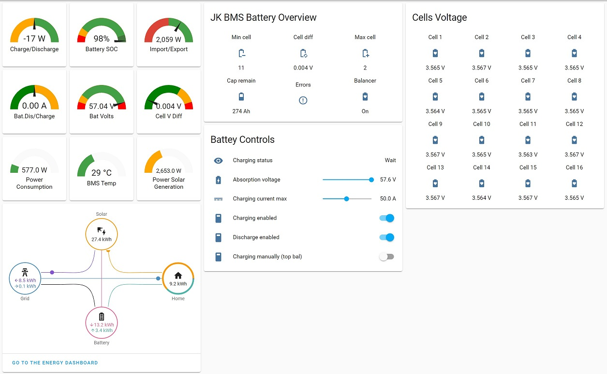

# esphome-jk-bms-can


[](https://www.paypal.com/donate/?hosted_button_id=D2AULK7N5D242)

ESPHome component to monitor a Jikong Battery Management System (JK-BMS) via RS485 or BLE

## This fork supports CAN bus communication with inverters supporting the CANBUS Protocol compatible with Pylontech V1.3 and Goodwe V1.5.
Note Pylontech uses 15s/48v Goodwe uses 16s/51.2v @3.2v/cell nominal. 
Select the correct battery profile in the inverter to match your battery pack!

The ESP32 communicates with the JK-BMS using the RS485 port(GPS) which is in fact not RS485, it is 3.3V TTL so it can be directly connected to the ESP32.
The ESP32 then sends the required CAN bus data to the inverter via a TJA1050 CAN bus transceiver.

Sends over CAN bus to inverter:
  - Battery Voltage
  - Battery Current (+charge, -discharge)
  - State of Charge (SOC)
  - State of health (SOH)
  - BMS Temperature
  - Charging Voltage
  - Charging Amps
  - Discharge min Voltage
  - Battery name
  - Alarms: Cell over/under voltage, Charge/discharge over current, High/low Temp, BMS fault
  - Charging logic: Complete rework of the charging logic, now charges with constant current(CC) to the absorption voltage, then has an absorption timer (Constant Voltage, user configurable time), with rebulk feature (user configurable offset from absorption voltage).
  
Note:- Support for only one BMS CAN connection per inverter, see here for more info on creating [larger capacity packs](https://github.com/Uksa007/esphome-jk-bms-can/discussions/1#discussioncomment-4359340)

Home Assistant native integration via ESPHome:
- Inverter control switches to manage inverter remotely
  - Disable inverter charging
  - Disable inverter discharging
  - Enable inverter charging (top balancing)
- All BMS sensor vaules listed below

I have been testing using the Goodwe LX U5.4-L battery profile selected in the inverter.<br>
Each LX U5.4-L battery has 5.4kWh of storage, so select the number that is the closest match to your battery's total capacity.<br>

**Note:- I'm using this with my Goodwe GW5000S-BP inverter however CAN bus support is still in development and testing!!!**<br>
Further deatils in the discussion tab https://github.com/Uksa007/esphome-jk-bms-can/discussions

If you find this useful and would like to <a href="https://www.paypal.com/donate/?hosted_button_id=D2AULK7N5D242" target="_blank">buy me a beer here</a> thanks!


* Connect a TJA1050 to an ESP32 (default GPIO 23 TX, 22 RX) as per https://esphome.io/components/canbus.html?highlight=can#wiring-options
* Use this code in esphome https://github.com/Uksa007/esphome-jk-bms-can/blob/main/esp32-example-can.yaml
* (optional) A second ESP32 and TJA1050 make a test CAN bus/receiver https://github.com/Uksa007/esphome-jk-bms-can/blob/main/test-esp32-receiver-can.yaml
  If you don't yet have TJA1050 you can still test with two ESP32 by making a makeshif CAN bus DO NOT CONNECT TO A REAL CAN BUS!
  Add a blocking diode between the CAN-TX and CAN-RX pins (cathode towards the CAN-TX pin) at both ESP32s!
  So a Diode between GPIO5, GPIO4 diode cathode to GPIO5 at both ESP32
  Then tie the CAN-RX lines together with a pull-up resistor to 3.3V I used 10K pullup.
  
 ## Home Assistant intergration



## Supported devices

All JK-BMS models with software version `>=6.0` are using the implemented protocol and should be supported.

* JK-BD6A17S6P, hw 7.2, sw 7.1.0H
* JK-BD6A17S8P, hw 9.x, sw 9.01G (reported by [@jonadis](https://github.com/syssi/esphome-jk-bms/issues/35#issuecomment-1035312712))
* JK-BD6A20S10P, hw 10.XW, sw 10.07 (reported by [@adadrag](https://github.com/syssi/esphome-jk-bms/issues/123))
* JK-BD6A24S6P, hw 6.x, sw 6.10S (reported by [@ziporah](https://github.com/syssi/esphome-jk-bms/issues/41))
* JK-BD6A24S10P, hw 8.x, sw 8.0.6G (reported by [@spoonwzd](https://github.com/syssi/esphome-jk-bms/issues/67#issuecomment-1093844076))
* JK-BD4A17S4P, hw 11.xw, sw 11.01 (reported by [@Condor-XYZ](https://github.com/syssi/esphome-jk-bms/issues/221))
* JK-B1A24S15P, hw 8.x, sw 8.1.0H (reported by [@killee](https://github.com/syssi/esphome-jk-bms/discussions/4))
* JK-B1A20S15P, hw 8.x, sw 8.14U (reported by  [@trippfam07](https://github.com/syssi/esphome-jk-bms/issues/31))
* JK-B2A24S15P, hw 6.x, sw 6.1.3S (reported by [@miguel300477](https://github.com/syssi/esphome-jk-bms/issues/57))
* JK-B2A24S15P, hw 8.x, sw 8.21W (reported by [@mariusvaida](https://github.com/syssi/esphome-jk-bms/issues/120))
* JK-B2A24S15P, hw 10.xw, sw 10.07
* JK-B2A24S15P, hw 10.xw, sw 10.08 (reported by [@meccip](https://github.com/syssi/esphome-jk-bms/discussions/175#discussioncomment-3687287))
* JK-B2A24S20P, hw 8.x, sw 8.1.2H (reported by [@KlausLi](https://github.com/syssi/esphome-jk-bms/issues/15#issuecomment-961447064))
* JK-B2A24S20P, hw 8.x, sw 8.20G (reported by [@rob-oravec](https://github.com/syssi/esphome-jk-bms/discussions/46))
* JK-B2A24S20P, hw 10.X-W, sw 10.02 (reported by [@SeByDocKy](https://github.com/syssi/esphome-jk-bms/issues/37#issuecomment-1040569576))
* JK-B2A24S20P, hw 10.XG, sw 10.07D30 (reported by [@TheSmartGerman](https://github.com/syssi/esphome-jk-bms/discussions/122))
* JK-B2A24S20P, hw 10.XW, sw 10.07 (reported by [@amagr0](https://github.com/syssi/esphome-jk-bms/issues/124#issuecomment-1166366196))
* JK-B2A8S20P,  hw 9.x, sw 9.01M3 (reported by [@EasilyBoredEngineer](https://github.com/syssi/esphome-jk-bms/discussions/110))
* JK-B2A8S20P, hw 9.x, sw 9.08W (reported by [@vrabi-cv](https://github.com/syssi/esphome-jk-bms/discussions/144#discussioncomment-3285901))
* JK-B2A8S20P, hw 11.XW, sw 11.17 (reported by [@senfkorn](https://github.com/syssi/esphome-jk-bms/issues/147))
* JK-B2A20S20P, hw 10.XW, sw 10.09 (reported by [@markusgg84](https://github.com/syssi/esphome-jk-bms/discussions/173))
* JK-B5A24S, hw 8.x, sw 8.0.3M, using `JK04` (reported by [@JSladen](https://github.com/syssi/esphome-jk-bms/issues/213))
* GW-24S4EB (NEEY/Heltec 4A Smart Active Balancer), hw HW-2.8.0, sw ZH-1.2.3 (reported by [@cristi2005](https://github.com/syssi/esphome-jk-bms/issues/109))

## Untested devices

* JK-BD6A20S6P

## Requirements

* [ESPHome 2022.11.0 or higher](https://github.com/esphome/esphome/releases).
* Generic ESP32, I use the esp32doit-devkit-v1
* NOTE ESP32-S2 currently has issues with CAN BUS and does not work!

## Schematics

<a href="https://raw.githubusercontent.com/uksa007/esphome-jk-bms-can/main/images/esp32.jpg" target="_blank">

</a>


```
                RS485-TTL                   RS232-TTL                CAN BUS
┌──────────┐                ┌─────────┐                ┌─────────┐              ┌──────────┐
│          │<----- RX ----->│         │<----- TX ----->|         |              |          |
│  JK-BMS  │<----- TX ----->│  ESP32  │<----- RX -4K7->| TJA1050 |<---CAN H --->| Inverter |
│          │<----- GND ---->│         │<----- GND ---->|   CAN   |<---CAN L --->|          |
│          │      3.3V ---->│         │<----- 5V ----->|         |              |          |
└──────────┘                └─────────┘                └─────────┘              └──────────┘

# RS485-TTL jack (4 Pin, JST 1.25mm pitch)
┌─── ─────── ────┐
│                │
│ O   O   O   O  │
│GND  RX  TX VBAT│
└────────────────┘
  │   │   │
  │   │   └─── GPIO17 (`rx_pin`)
  │   └─────── GPIO16 (`tx_pin`)
  └─────────── GND
```


The RS485-TTL jack of the BMS can be attached to any UART pins of the ESP. A hardware UART should be preferred because of the high baudrate (115200 baud). The connector is called 4 Pin JST with 1.25mm pitch.

## Installation

You can install this component with [ESPHome external components feature](https://esphome.io/components/external_components.html) like this:
```yaml
external_components:
  - source: github://uksa007/esphome-jk-bms-can@main
```

or just use the `esp32-example-can.yaml` as proof of concept:

```bash
# Install esphome
pip3 install esphome

# Clone this external component
git clone https://github.com/uksa007/esphome-jk-bms-can.git
cd esphome-jk-bms-can

# Create a secrets.yaml containing some setup specific secrets
cat > secrets.yaml <<EOF
wifi_ssid: MY_WIFI_SSID
wifi_password: MY_WIFI_PASSWORD

# Validate the configuration, create a binary, upload it, and start logs
esphome run esp32-example-can.yaml

# Optional add to Home Assistant
In Home Assistant under settings->Intergration "Add Intergration" select ESPHome add device jk-bms-can if found or supply ip address of ESP32

```
## Example CAN messages

```
[main:141]: send can id: 0x359 hex: 0 0 0 0 3 0 0 0
[canbus:033]: send extended id=0x359 rtr=FALSE size=8
[main:187]: send can id: 0x351 hex: 28 2 e8 3 e8 3 a0 1
[canbus:033]: send extended id=0x351 rtr=FALSE size=8
[main:199]: send can id: 0x355 hex: 4f 0 64 0
[canbus:033]: send extended id=0x355 rtr=FALSE size=4
[main:213]: send can id: 0x356 hex: 63 14 62 fc 86 1
[canbus:033]: send extended id=0x356 rtr=FALSE size=6
[canbus:070]: received can message (#1) std can_id=0x305 size=8
[light:035]: 'Builtin LED' Setting:
[light:046]:   State: OFF
[main:238]: send can id: 0x35C hex: c0 0
[canbus:033]: send extended id=0x35c rtr=FALSE size=2
[canbus:033]: send extended id=0x35e rtr=FALSE size=8
```

## Example response all sensors enabled

```
[sensor:125]: 'jk-bms-can cell voltage 1': Sending state 3.27200 V with 3 decimals of accuracy
[sensor:125]: 'jk-bms-can cell voltage 2': Sending state 3.26900 V with 3 decimals of accuracy
[sensor:125]: 'jk-bms-can cell voltage 3': Sending state 3.26800 V with 3 decimals of accuracy
[sensor:125]: 'jk-bms-can cell voltage 4': Sending state 3.26700 V with 3 decimals of accuracy
[sensor:125]: 'jk-bms-can cell voltage 5': Sending state 3.25000 V with 3 decimals of accuracy
[sensor:125]: 'jk-bms-can cell voltage 6': Sending state 3.26600 V with 3 decimals of accuracy
[sensor:125]: 'jk-bms-can cell voltage 7': Sending state 3.25600 V with 3 decimals of accuracy
[sensor:125]: 'jk-bms-can cell voltage 8': Sending state 3.26800 V with 3 decimals of accuracy
[sensor:125]: 'jk-bms-can cell voltage 9': Sending state 3.25800 V with 3 decimals of accuracy
[sensor:125]: 'jk-bms-can cell voltage 10': Sending state 3.26000 V with 3 decimals of accuracy
[sensor:125]: 'jk-bms-can cell voltage 11': Sending state 3.26200 V with 3 decimals of accuracy
[sensor:125]: 'jk-bms-can cell voltage 12': Sending state 3.25700 V with 3 decimals of accuracy
[sensor:125]: 'jk-bms-can cell voltage 13': Sending state 3.25700 V with 3 decimals of accuracy
[sensor:125]: 'jk-bms-can cell voltage 14': Sending state 3.26000 V with 3 decimals of accuracy
[sensor:125]: 'jk-bms-can cell voltage 15': Sending state 3.26500 V with 3 decimals of accuracy
[sensor:125]: 'jk-bms-can cell voltage 16': Sending state 3.26800 V with 3 decimals of accuracy
[sensor:125]: 'jk-bms-can min cell voltage': Sending state 3.25000 V with 3 decimals of accuracy
[sensor:125]: 'jk-bms-can max cell voltage': Sending state 3.27200 V with 3 decimals of accuracy
[sensor:125]: 'jk-bms-can max voltage cell': Sending state 1.00000  with 0 decimals of accuracy
[sensor:125]: 'jk-bms-can min voltage cell': Sending state 5.00000  with 0 decimals of accuracy
[sensor:125]: 'jk-bms-can delta cell voltage': Sending state 0.02200 V with 3 decimals of accuracy
[sensor:125]: 'jk-bms-can average cell voltage': Sending state 3.26269 V with 3 decimals of accuracy
[sensor:125]: 'jk-bms-can power tube temperature': Sending state 39.00000 °C with 0 decimals of accuracy
[sensor:125]: 'jk-bms-can temperature sensor 1': Sending state 26.00000 °C with 0 decimals of accuracy
[sensor:125]: 'jk-bms-can temperature sensor 2': Sending state 26.00000 °C with 0 decimals of accuracy
[sensor:125]: 'jk-bms-can total voltage': Sending state 52.20000 V with 2 decimals of accuracy
[sensor:125]: 'jk-bms-can current': Sending state -92.64000 A with 2 decimals of accuracy
[sensor:125]: 'jk-bms-can power': Sending state -4835.80762 W with 2 decimals of accuracy
[sensor:125]: 'jk-bms-can charging power': Sending state 0.00000 W with 2 decimals of accuracy
[sensor:125]: 'jk-bms-can discharging power': Sending state 4835.80762 W with 2 decimals of accuracy
[sensor:125]: 'jk-bms-can capacity remaining': Sending state 79.00000 % with 0 decimals of accuracy
[sensor:125]: 'jk-bms-can temperature sensors': Sending state 2.00000  with 0 decimals of accuracy
[sensor:125]: 'jk-bms-can charging cycles': Sending state 4.00000  with 0 decimals of accuracy
[sensor:125]: 'jk-bms-can total charging cycle capacity': Sending state 1280.00000 Ah with 0 decimals of accuracy
[sensor:125]: 'jk-bms-can battery strings': Sending state 16.00000  with 0 decimals of accuracy
[sensor:125]: 'jk-bms-can errors bitmask': Sending state 0.00000  with 0 decimals of accuracy
[text_sensor:067]: 'jk-bms-can errors': Sending state ''
[sensor:125]: 'jk-bms-can operation mode bitmask': Sending state 3.00000  with 0 decimals of accuracy
[text_sensor:067]: 'jk-bms-can operation mode': Sending state 'Charging enabled;Discharging enabled'
[sensor:125]: 'jk-bms-can total voltage overvoltage protection': Sending state 57.60000 V with 2 decimals of accuracy
[sensor:125]: 'jk-bms-can total voltage undervoltage protection': Sending state 41.60000 V with 2 decimals of accuracy
[sensor:125]: 'jk-bms-can cell voltage overvoltage protection': Sending state 3.60000 V with 3 decimals of accuracy
[sensor:125]: 'jk-bms-can cell voltage overvoltage recovery': Sending state 3.55000 V with 3 decimals of accuracy
[sensor:125]: 'jk-bms-can cell voltage overvoltage delay': Sending state 5.00000 s with 0 decimals of accuracy
[sensor:125]: 'jk-bms-can cell voltage undervoltage protection': Sending state 2.60000 V with 3 decimals of accuracy
[sensor:125]: 'jk-bms-can cell voltage undervoltage recovery': Sending state 2.65000 V with 3 decimals of accuracy
[sensor:125]: 'jk-bms-can cell voltage undervoltage delay': Sending state 5.00000 s with 0 decimals of accuracy
[sensor:125]: 'jk-bms-can cell pressure difference protection': Sending state 0.30000 V with 3 decimals of accuracy
[sensor:125]: 'jk-bms-can discharging overcurrent protection': Sending state 100.00000 A with 0 decimals of accuracy
[sensor:125]: 'jk-bms-can discharging overcurrent delay': Sending state 300.00000 s with 0 decimals of accuracy
[sensor:125]: 'jk-bms-can charging overcurrent protection': Sending state 100.00000 A with 0 decimals of accuracy
[sensor:125]: 'jk-bms-can charging overcurrent delay': Sending state 30.00000 s with 0 decimals of accuracy
[sensor:125]: 'jk-bms-can balance starting voltage': Sending state 3.40000 V with 3 decimals of accuracy
[sensor:125]: 'jk-bms-can balance opening pressure difference': Sending state 0.00500 V with 3 decimals of accuracy
[sensor:125]: 'jk-bms-can power tube temperature protection': Sending state 90.00000 °C with 0 decimals of accuracy
[sensor:125]: 'jk-bms-can power tube temperature recovery': Sending state 70.00000 °C with 0 decimals of accuracy
[sensor:125]: 'jk-bms-can temperature sensor temperature protection': Sending state 100.00000 °C with 0 decimals of accuracy
[sensor:125]: 'jk-bms-can temperature sensor temperature recovery': Sending state 100.00000 °C with 0 decimals of accuracy
[sensor:125]: 'jk-bms-can temperature sensor temperature difference protection': Sending state 20.00000 °C with 0 decimals of accuracy
[sensor:125]: 'jk-bms-can charging high temperature protection': Sending state 70.00000 °C with 0 decimals of accuracy
[sensor:125]: 'jk-bms-can discharging high temperature protection': Sending state 70.00000 °C with 0 decimals of accuracy
[sensor:125]: 'jk-bms-can charging low temperature protection': Sending state -20.00000 °C with 0 decimals of accuracy
[sensor:125]: 'jk-bms-can charging low temperature recovery': Sending state -10.00000 °C with 0 decimals of accuracy
[sensor:125]: 'jk-bms-can discharging low temperature protection': Sending state -20.00000 °C with 0 decimals of accuracy
[sensor:125]: 'jk-bms-can discharging low temperature recovery': Sending state -10.00000 °C with 0 decimals of accuracy
[sensor:125]: 'jk-bms-can total battery capacity setting': Sending state 280.00000 Ah with 0 decimals of accuracy
[sensor:125]: 'jk-bms-can capacity remaining derived': Sending state 221.19998 Ah with 0 decimals of accuracy
[sensor:125]: 'jk-bms-can current calibration': Sending state 1.04800 A with 3 decimals of accuracy
[sensor:125]: 'jk-bms-can device address': Sending state 1.00000  with 0 decimals of accuracy
[text_sensor:067]: 'jk-bms-can battery type': Sending state 'Ternary Lithium'
[sensor:125]: 'jk-bms-can sleep wait time': Sending state 10.00000 s with 0 decimals of accuracy
[sensor:125]: 'jk-bms-can alarm low volume': Sending state 20.00000 % with 0 decimals of accuracy
[text_sensor:067]: 'jk-bms-can password': Sending state '123456'
[text_sensor:067]: 'jk-bms-can device type': Sending state 'Input Us'
[sensor:125]: 'jk-bms-can total runtime': Sending state 226.13333 h with 0 decimals of accuracy
[text_sensor:067]: 'jk-bms-can total runtime formatted': Sending state '9d 10h'
[text_sensor:067]: 'jk-bms-can software version': Sending state '10.XG_S10.07___'
[sensor:125]: 'jk-bms-can actual battery capacity': Sending state 256.00000 Ah with 0 decimals of accuracy
[text_sensor:067]: 'jk-bms-can manufacturer': Sending state 'Input UserdaJK-B2A24S15P'
```

## Known issues

* The battery type sensor is pretty useless because the BMS reports always the same value (`Ternary Lithium`). Regardless of which battery type was set / parameter set was loaded via the android app. ([#9][i9])
* ESP32: Adding all supported sensors can lead to a stack overflow / boot loop. This can be solved by increasing the stack size. ([#63][i63])
* BLE: Please stick to the `esp-idf` framework because the Arduino framework crashs on the first received BLE notification.
* Raspberry Pi & ESP-IDF: If the project doesn't compile because of `Error: Could not find the package with 'platformio/toolchain-esp32ulp @ ~1.22851.0' requirements for your system 'linux_aarch64'` please use a host with another processor architecture (f.e. x86). The toolchain isn't `linux_aarch64` (ARM64) compatible at the moment.
* MQTT & BLE: Please use ESPHome `>=2022.4.0` if you want to use the BLE component (requires `esp-idf`) and MQTT. The MQTT component wasn't ESP-IDF compatible until then.

[i9]: https://github.com/syssi/esphome-jk-bms/issues/9
[i63]: https://github.com/syssi/esphome-jk-bms/issues/63

## Debugging

If this component doesn't work out of the box for your device please update your configuration to enable the debug output of the UART component and increase the log level to the see outgoing and incoming serial traffic:

```
logger:
  level: DEBUG

uart:
  id: uart0
  baud_rate: 115200
  rx_buffer_size: 384
  tx_pin: GPIO14
  rx_pin: GPIO4
  debug:
    direction: BOTH
```

## References
* https://github.com/syssi/esphome-jk-bms Thanks go to syssi for help and making the original RS485 code!
* https://secondlifestorage.com/index.php?threads/jk-b1a24s-jk-b2a24s-active-balancer.9591/
* https://github.com/jblance/jkbms
* https://github.com/jblance/mpp-solar/issues/112
* https://github.com/jblance/mpp-solar/blob/master/mppsolar/protocols/jk232.py
* https://github.com/jblance/mpp-solar/blob/master/mppsolar/protocols/jk485.py
* https://github.com/sshoecraft/jktool
* https://github.com/Louisvdw/dbus-serialbattery/blob/master/etc/dbus-serialbattery/jkbms.py
* https://blog.ja-ke.tech/2020/02/07/ltt-power-bms-chinese-protocol.html
